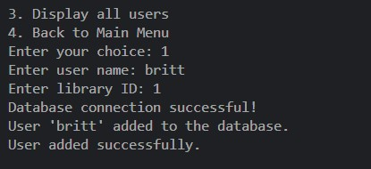

# Mini Project 

In this project, you will integrate a MySQL database with Python to develop an advanced Library Management System. This command-line-based application is designed to streamline the management of books and resources within a library. Your mission is to create a robust system that allows users to browse, borrow, return, and explore a collection of books while demonstrating your proficiency in database integration, SQL, and Python. 

### What are the requirements? 

*Enhanced User Interface (UI) and Menu*
*Book Operations*
*User Operations*
*Author Operations*
*Database Integration with MySQL*

### What are the expectations of this program?
For this project, you will build upon the foundation laid in "Module 4: Python Object-Oriented Programming (OOP)." The object-oriented structure and classes you developed in that module will serve as the core framework for the Library Management System. You will leverage the classes such as Book, User, Author, and Genre that you previously designed, extending their capabilities to integrate seamlessly with the MySQL database.

### Extensions needed:
*python*
*python debugger*
*mysql workbench*
*markdown checkboxes*

## Programming steps:

***Enhanced User Interface (UI) and Menu*** :handshake:	
Create an improved, user-friendly command-line interface (CLI) for the Library Management System with separate menus for each class of the system.

``` Example of Menu

def user_operations():
    while True:
        print("\nUser Operations:")
        print("1. Add a new user")
        print("2. View user details")
        print("3. Display all users")
        print("4. Back to Main Menu")

        choice = input("Enter your choice: ")

        if choice == '1':
            name = input("Enter user name: ")
            library_id = input("Enter library ID: ")
            user = User(name, library_id)
            user.add_to_db()
            print("User added successfully.")
        elif choice == '2':
            library_id = input("Enter user library ID: ")
            user = User.get_user_details(library_id)
            print(user)
        elif choice == '3':
            db = create_connection()
            cursor = db.cursor(dictionary=True)
            cursor.execute("SELECT * FROM users")
            users = cursor.fetchall()
            for user in users:
                print(user)
            cursor.close()
            db.close()
        elif choice == '4':
            break
        else:
            print("Invalid choice! Please try again.")
```


***Book Operations*** 	:books:

``` book menu 
def book_operations():
    while True:
        print("\nBook Operations:")
        print("1. Add a new book")
        print("2. Borrow a book")
        print("3. Return a book")
        print("4. Search for a book")
        print("5. Display all books")
        print("6. Back to Main Menu")

        choice = input("Enter your choice: ")
```


***User Operations***	:bust_in_silhouette: 

```user menu
def user_operations():
    while True:
        print("\nUser Operations:")
        print("1. Add a new user")
        print("2. View user details")
        print("3. Display all users")
        print("4. Back to Main Menu")

        choice = input("Enter your choice: ")
```

***Author Operations***  :pencil:


```author menu

def author_operations():
    while True:
        print("\nAuthor Operations:")
        print("1. Add a new author")
        print("2. Search for an author")
        print("3. Back to Main Menu")

        choice = input("Enter your choice: ")
```
***Database Integration with MySQL*** ::
1. Integrate a MySQL database into the Library Management System to store and retrieve data related to books, users, authors, and genres.
2. Design and create the necessary database tables to represent these entities. You will align these tables with the object-oriented structure from the previous project.  

Example from book class:
``` 
class Book:
    def __init__(self, title, author_id, publication_date, availability=True):
        self.title = title
        self.author_id = author_id
        self.publication_date = publication_date
        self.availability = availability

    def add_to_db(self):
        db = create_connection()
        cursor = db.cursor()
        query = "INSERT INTO books (title, author_id, publication_date, availability) VALUES (%s, %s, %s, %s)"
        cursor.execute(query, (self.title, self.author_id, self.publication_date, self.availability))
        db.commit()
        cursor.close()
        db.close()

   
    def search_books(title=None, author_name=None):
        db = create_connection()
        cursor = db.cursor(dictionary=True)

        if not title and not author_name:
            raise ValueError("Please provide either a title or an author name to search.")

        if title and author_name:
            query = "SELECT b.* FROM books b JOIN authors a ON b.author_id = a.id WHERE b.title LIKE %s AND a.name LIKE %s"
            cursor.execute(query, ('%' + title + '%', '%' + author_name + '%'))
        elif title:
            query = "SELECT * FROM books WHERE title LIKE %s"
            cursor.execute(query, ('%' + title + '%',))
        elif author_name:
            query = "SELECT b.* FROM books b JOIN authors a ON b.author_id = a.id WHERE a.name LIKE %s"
            cursor.execute(query, ('%' + author_name + '%',))

        books = cursor.fetchall()
        cursor.close()
        db.close()
        return books
```
Establish connections between Python and the MySQL database for data manipulation, enhancing the persistence and scalability of your Library Management System.

*I was able to create a connection to my database to add a user!*


Data Definition Language Scripts:
``` 

USE libraryManagementdb;

CREATE TABLE authors (
    id INT AUTO_INCREMENT PRIMARY KEY,
    name VARCHAR(255) NOT NULL,
    biography TEXT
);

CREATE TABLE books (
    id INT AUTO_INCREMENT PRIMARY KEY,
    title VARCHAR(255),
    author_id INT,
    publication_date DATE,
    availability BOOLEAN DEFAULT TRUE,
    FOREIGN KEY (author_id) REFERENCES authors(id)
);

CREATE TABLE users (
    id INT AUTO_INCREMENT PRIMARY KEY,
    name VARCHAR(255) NOT NULL,
    library_id VARCHAR(10) NOT NULL UNIQUE
);

CREATE TABLE borrowed_books (
    id INT AUTO_INCREMENT PRIMARY KEY,
    user_id INT,
    book_id INT,
    borrow_date DATE NOT NULL,
    return_date DATE,
    FOREIGN KEY (user_id) REFERENCES users(id),
    FOREIGN KEY (book_id) REFERENCES books(id)
);

```


#### Where can I find the program?
[Library Management System Database](https://github.com/brittmarie333/Library-Management-Database-Mini-Project.git) :computer:
